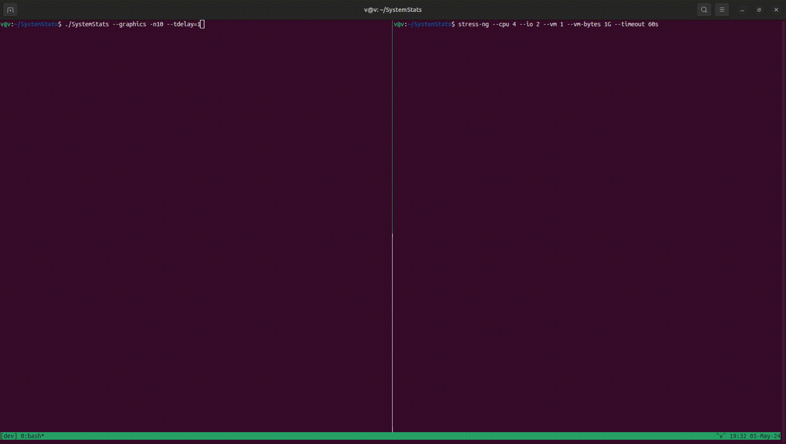

# System Monitor

## About
- Linux system monitoring tool for the Software Tools and Systems Programming course
- Retrieves, calculates, and displays memory, user, and cpu usage data concurrently using separate processes
- Communicates data between processes via pipes
- Handles signals sent by the user
- Score: Achieved 100% assignment grade (Concurrent System Monitor), 122% on the Sequential System Monitor Assignment, and 106% on the File Descriptors Table Assignment
- All stages of all three assignments built from the ground up.
- Author: Vincent Zhang
- Since: 2024-03-15 to 2024-04-08
- Tech: C, Make, linux, multi-processing (cuncurrency), signal handling, pipe communication

## Demo

## How the problem was solved.
Problem: Create a concurrent system monitoring tool with C.

Solution: Follow the steps 1 to 4 to recreate this implementation of the concurrent system monitoring tool.

1. Design concurrent solution.
    1. Concurrent Design / Pipe Communication.
        1. To retrieve memory, users, and CPU information concurrently, three child processes need to run concurrently to retrieve and report the information. This is done by forking the parent into parent and child 1 where child 1 retrieves memory information and writes to its dedicated pipe. At the same time the parent process forks another child, child 2 that retrieves and writes user information. At the same time, the parent process forks a third child process to retrieve and write to pipe the CPU usage information. The parent process then reads from each pipe and stores the result in an output string. Finally the output data retrieved concurrently is displayed in the main process in the correct order.
    2. Signal Handling.
        1. ctrl+z. Any SIGTSTP signal is directly ignored with SIG_IGN.
        2. ctrl+c. A SIGINT signal in the parent is sent to a custom signal handler which prompts the user for confirmation to quit. The SIGINT is also received by the child process which is handled differently by directly terminating the child process. See section 1.3. below for why this design was chosen.
        3. Child exits. Any SIGCHLD signal is directly ignored with SIG_IGN to prevent creation of zombies, especially during a system interrupt. See section 1.3. below for details.
    3. Zombie/Orphan Management.
        1. It is not possible for zombies to be created in this program as any SIGCHLD signal is handled with SIG_IGN. This design prevents zombies from spawning during a system interrupt in which the user has yet to confirm whether to continue or quit the program. In doing so, there is no possibilities that zombies will progressively consume resources.
        2. Neither is it possible for orphans to be created as the parent does not terminate until data is read from each child process, at which point the child process would have terminated. Further, any child process is immediately terminated during a signal interrupt received from the parent. This prevents not just double prompting for confirmation to exit, it prevents any possibility of orphan processes to be created. Moreover, this design ensures that sampling is consistent as a sample interrupted by a signal will not be sample at the same interval as specified by tdelay for CPU usage calculations.
        3. To conclude, zombies and orphans states are not possible in this tool.
2. Design and research functions for target features and flow/logic for program.
    1. Libraries used.
        1. `<stdio.h>`           To use `<printf>` and other IO functions to handle IO manipulations.
        2. `<stdlib.h>`          To use standard functions and constants like `<exit>`, `<EXIT_FAILURE>`, `<strtol>`, `<atoi>`, `<malloc>`, `<free>`.
        3. `<string.h>`          To find the occurrence of the string "processor" using `<strstr>` when reading "/proc/cpuinfo" to find number of CPU cores.
        4. `<unistd.h>`          To use `<sleep>` to create a delay matching the provided sampling frequency and to create a delay between two CPU time samples.
        5. `<utmp.h>`            To get user usage information using `<setutent>`, `<getutent>`, `<endutent>`, `<USER_PROCESS>`.
        6. `<getopt.h>`          To parse command-line arguments using `<struct option>`, `<getopt_long>`, `<no_argument>`, `<optional_argument>`.
        7. `<sys/utsname.h>`     To get system/machine information using `<struct utsname>`, `<uname>`.
        8. `<sys/sysinfo.h>`     To get memory usage and system uptime using `<sysinfo>`, `<struct sysinfo>`.
        9. `<sys/resource.h>`    To get memory self-usage of the program using `<struct rusage>`, `<getrusage>`, `<RUSAGE_SELF>`.
        10. `<signal.h>`         To define custom signal handlers and perform signal handling for various signals.
    2. Functions created.
        1. `main`                   To act as the entry-point of the program. To parse command-line arguments. To initialize flags. To initiate system monitoring tool.
        2. `monitor_system`         To control the main flow of the monitoring tool. Controls all 5 components of 2.b-f. below. Controls the main loop through the number of samples. Controls sampling frequency. The decision-maker for which feature is displayed. Handles flow for creating pipes and forking new child processes to report system information. Reads data passed from children through pipes.
        3. `print_self_memuse`      To print the self memory usage of the program.
        4. `print_memory_usage`     To print the memory usage of the machine.
        5. `print_user_usage`       To print the user usage information.
        6. `get_cores`              To retrieve the number of cores in the CPU of the machine.
        7. `get_cpu_total_idle`     To get the CPU total time and idle time to be used for CPU usage computations.
        8. `get_cpu_usage`          To compute CPU usage using total and idle time.
        9. `print_cpu_usage`        To print CPU usage previously computed.
        10. `print_system_info`     To print system information related to the machine.
        11. `is_nonneg`             Helper function to determine if a string is a non-negative integer when processing command-line arguments.
        12. `bytes_to_gb`           Helper function to convert bytes to GB for easier viewing of memory information from sysinfo.
        13. `move_cursor_print`     Helper function to move the cursor in the terminal up or down so that information is updated in-place for easier viewing.
        14. `move_cursor`           Helper function to move the cursor in the terminal up or down so that information is updated in-place for easier viewing by storing escape character in string.
        15. `erase_line`            Helper function to erase the line the cursor currently resides so that updated information can be inputted in that line.
        16. `save_cursor`           Helper function to save the current position of the cursor so that the cursor may return to the saved location to update the information in that line.
        17. `restore_cursor`        Helper function to restore the saved position of the cursor.
        18. `print_footer`          Helper function to print a footer to separate presented information for easier viewing.
        19. `fetch_latest_sysinfo`  Helper function to get the latest system information regarding uptime and memory usage.
        20. `writefd`               Helper function to write a string to a given fd to reduce redundancy.
        21. `sig_handler`           Helper function to define custom signal handler for SIGINT in parent process.
        22. `child_handler`         Helper function to define custom signal handler for SIGINT in child process.
        23. `closefd`               Helper function to close file descriptor with error handling.
        24. `read_child`            Helper function to read from file descriptors written to by child.
3. Write modular, clear, concise functions for each component:
    1. Command-line argument parsing.
    2. Running parameters.
    3. Memory usage.
    4. User usage.
    5. CPU usage.
    6. System information.
4. Testing.
    1. Compile with -Wall flag.
    2. Check for memory leaks using Valgrind. `valgrind --leak-check=full --show-leak-kinds=all --track-origins=yes ./SystemStats`
    3. Test with a variety of combination of command-line arguments/flags.
    4. Time runs with "time" command to ensure program runs within the 1% time threshold.

## Overview of functions.
1. Helper functions.
    1. `is_nonneg` - Non negative integer checking.
        
        `@val:` The given string.
        
        `@return:` 1 if @val is a non-negative integer, 0 otherwise.
        
        How: Achieves checking by attempting to convert string to long using `<strtol>` while keeping a pointer to the end of processing. If the end of processing is null terminator then entire string is a long so check if it's non-negative, otherwise the string does not have an equivalent integral value.

    2. `bytes_to_gb` - Converts integral value in bytes to gigabytes.
        
        `@x:` The given integral value, which must be in bytes.
        
        `@return:` Converted value in gigabytes.
        
        How: Achieves conversion by dividing the input by the conversion factor.

    3. `move_cursor_print` - Move the cursor of the terminal down or up `<n_lines>` number of lines.
        
        `@n_lines:` Number of lines to move up or down, if positive down, if negative up.
        
        `@return:` void
        
        How: Achieves cursor repositioning in terminal by printing special ASCII ESCape codes.

    4. `move_cursor` - Move the cursor of the terminal down or up `<n_lines>` number of lines by storing escape character in `<str>`.
        
        `@str:` String to store the move cursor character to.
        
        `@n_lines:` Number of lines to move up or down, if positive down, if negative up.
        
        `@return:` void
        
        How: Achieves cursor repositioning in terminal by printing special ASCII ESCape codes.

    5. `erase_line` - Erase the line the cursor is at in the terminal.
        
        `@str:` Destination to store erase character to.
        
        `@return:` void
        
        How: Achieves erasing in terminal by storing special ASCII ESCape code in a string to be printed.

    6. `save_cursor` - Save the position of the cursor in the terminal.
        
        `@return:` void
        
        How: Achieves cursor position saving in terminal by printing special ASCII ESCape code.
    
    7. `restore_cursor` - Restore the saved position of the cursor in the terminal.
        
        `@return:` void
        
        How: Achieves cursor restoring in terminal by printing special ASCII ESCape code.
    
    8. `print_footer` - Print a separator that acts as a footer.
        
        `@return:` void
        
        How: Achieves separator printing by using `<printf>` to print a sequence of dashes.
    

    9. `fetch_latest_sysinfo` - Fetch most up-to-date system information.
        
        `@sys_info:` Pointer to the sysinfo struct defined at the function call to store updated system information values.
        
        `@return:` void
        
        How: Achieves fetching latest system information by calling `<sysinfo>`, storing result in `<sys_info>`.
    
    10. `writefd` - Write given string to given fd.
        
        `@fd:` The file descriptor to write to.
        
        `@s:` The string to write.
        
        `@return:` void
        
        How: Achieves writing string to fd with the write() function.

    11. `sig_handler` - Define custom signal handler for SIGINT in parent process.
        
        `@signum:` Signal number of the signal received.
        
        `@return:` void
        
        How: Achieves signal handling by prompting user for confirmation when receiving SIGINT.

    12. `child_handler` - Define custom signal handler for SIGINT in child process.
        
        `@signum:` Signal number of the signal received.
        
        `@return:` void
        
        How: Achieves signal handling by terminating child process when receiving SIGINT. The design of terminating the child process when receiving SIGINT is chosen because otherwise CPU usage sample would not be consistent with other samples when sampling is interrupted.
    
    13. `closefd` - Close fd with error handling.
        
        `@fd:` The file descriptor to close.
        
        `@return:` void
        
        How: Achieves fd closing with error handling by checking for close return status when closing.

    14. `read_child` - Read from file descriptor written to from a specific chil4. When nothing can be read e.g., after a signal interrupt, ignore.
        
        `@fd:` The child's file descriptors.
        
        `@line:` Location to store the line read.
        
        `@size:` Max size to read.
        
        How: Achieves reading  child fd by calling read and null-terminating.

2. Functions related to displaying running parameters.
    
    15. `print_self_memuse` - Get and print self memory usage.
        
        `@return:` void
        
        How: Achieves getting self memory usage by using `<getrusage>` to get the max resident set size.

3. Functions related to displaying memory usage.
    
    16. `print_memory_usage` - Write the memory usage information to pipe.
        
        `@fd:` File descriptor to write data to.
        
        `@flag_graphics:` Whether to display graphics. Display graphics if 1.
        
        `@prev_virtual:` Previous total virtual memory usage initialized to -1.
        
        `@total_phys:` Current total physical memory.
        
        `@total_virtual:` Current used total memory.
        
        `@return:` void
        
        How: Achieves printing of memory usage by using `<printf>` to output the variables given in the input and displaying graphical information depending on the value of `<flag_graphics>`. Displays the number of "#" or ":" symbols based on the formula abs(change*100) where change is how much the memory usage changed.

4. Functions related to displaying user usage.

    17. `print_user_usage` - Write user usage information to pipe.
        
        `@fd:` File descriptor to write data to.
        
        `@flag_sequential:` Output in sequential format if 1, non-sequential if 0.
        
        `@return:` void
        
        How: Achieves printing user usage by using `<getutent>` to get `<ut_user>` `<ut_line>` and `<ut_host>`.
    
5. Functions related to displaying cpu usage.
    
    18. `get_cores` - Find and return number of cores.
        
        `@return:` The number of cores of the machine CPU.
        
        How: Achieves getting number of CPU cores by reading "/proc/cpuinfo" and counting lines with "processor".

    19. `get_cpu_total_idle` - Get total CPU time and idle time from /proc/stat.
        
        `@result:` Where the result of computations of this function will be stored. Total CPU time is at index 0 and idle CPU time is at index 1 of `<result>`.
        
        `@return:` void
        
        How: Achieves getting CPU total and idle time by reading "/proc/stat" and getting all CPU time from the line starting with "cpu". The idle time is obtained and the total is computed from the sum of all CPU times.

    20. `get_cpu_usage` - Compute the CPU usage by taking two samples of CPU total and idle time one second apart.
        
        `@return:` Percentage CPU usage.
        
        How: Achieves getting CPU usage by taking two samples of CPU total and idle time separated by 1 second delay and finding the ratio of non-idle time to total time within that 1 second time frame.

    21. `print_cpu_usage` - Write CPU usage information to pipe.
        
        `@fd:` File descriptor to write data to.
        
        `@flag_graphics:` Displays graphics if flag is 1, otherwise no graphics.
        
        `@flag_sequential:` Sequential output if flag is 1, otherwise in-place.
        
        `@i:` The iteration number in the loop through the samples.
        
        `@return:` void
        
        How: Achieves printing CPU usage by getting the CPU usage and printing according to the provided flags. The spacing is done by using the provided index. The graphical representation of the number of bars to display to represent the CPU usage is determined by the formula 2 + (int)(cpu_usage+1).

6. Functions related to displaying system information.
    
    22. `print_system_info` - Find and print system information.
        
        `@return:` void
        
        How: Achieves printing system information by storing the information retrieved from `<uname>` in `<struct utsname>`. Information retrieved includes system name, machine name, version, release, architecture.

7. Functions related to flow control.
    
    23. `monitor_system` - Control the main flow of system monitoring, calling on five components: 1. running parameters 2. memory usage 3. user usage 4. CPU usage 5. system information.
        
        `@samples:` Number of samples to take, must be integer.
        
        `@tdelay:` Sampling frequency in seconds.
        
        `@flag_graphics:` Flag to display graphics if set to 1 otherwise no graphics.
        
        `@flag_sequential:` Flag to display sequential output if set to 0, otherwise in-place output.
        
        `@display_system:` If value is 1, system usage information will be displayed otherwise it will not.
        
        `@display_user:` If value is 1, user usage information will be displayed otherwise it will not.
        
        `@return:` void
        
        How: Controls the main flow of the program by initializing values include the total physical and virtual memory and previous virtual memory. Then controlling the main loop through the number of samples and controlling the sampling frequency using a delay. Based on inputs, it determines which information to display and passes the relevant flags. It handles printing of header and footer for a major portion of the components. It handles the cursor saving, restoring, moving to ensure a convenient viewing experience.

8. Main function.

    24. `main` - Entry point of the program. Defines custom signal handlers. Parses command-line arguments and initiates the system monitoring.
        
        `@argc:` Number of command-line arguments.
        
        `@argv:` Argument vector.
        
        `@return:` 0 if program successfully terminates.
        
        How: Achieves parsing command-line arguments using `<getopt_long>` and separate logic for parsing non-option arguments, i.e., the positional arguments to specify `<samples>` and `<tdelay>`. It performs simple logic to determine in which cases the user and system information should be displayed, these decisions are stored in `<display_system>` and `<display_user>` which are passed to `<monitor_system>`. The logic for handling positional arguments sets the rule that flags specified with valid values takes precedence over positional arguments and valid positional arguments takes precedent over default values. And the logic also set the rule that when valid positional arguments are given, they must appear in the order of `<samples>` then `<tdelay>` meaning that if a valid flag value is set for `<samples>` and only one positional argument is given, then the single positional argument corresponds to `<samples>` not `<tdelay>` and since `<samples>` has it value set by a flag already the flag value will take precedence over the positional argument and the value stored in `<samples>` will the one given by the flag while `<tdelay>` retains its default value. Moreover, only the first two valid positional arguments are considered for `<samples>` and `<tdelay>` all others will be ignored.

## Using the program.
1. Running the program.
    1. Run `clear`              To clear the screen to ensure best viewing experience.
    2. Run `make`               To compile the program.
    3. Run `./SystemStats`      To run the program. Optionally add flags listed below, or add valid positional arguments (see Section C and D below to understand how to use positional arguments or see section h.18 in overview of functions to understand how positional arguments are processed).

2. Flags.
    1. `--system`     or `-s`   To display system usage.
    2. `--user`       or `-u`   To display users usage.
    3. `--graphics`   or `-g`   To display graphics.
    4. `--sequential` or `-q`   To display sequential output.
    5. `--samples=N`  or `-nN`  To specify samples. Default 10 if unspecified or invalid value. Must be integral value.
    6. `--tdelay=T`   or `-tT`  To specify frequency. Default 1 sec if unspecified or invalid value. Must be integral value.

3. Arguments.
    - Only the first 2 integers will be taken as candidates for `<samples>` and `<tdelay>` as positional arguments.
    - Flags with valid values takes precedence over positional arguments with valid values over default values for `<samples>` and `<tdelay>`.
    - If only one `<sample>` or `<tdelay>` flag is set, then valid positional arguments maintains the order that `<samples>` come before `<tdelay>`. For example, if  only one positional argument is given and valid value is set for `<samples>` flag, then `<tdelay>` will retain its default value and not the single positional argument provided.
    - Invalid positional arguments will be ignored, including decimal numbers and negative numbers, and numbers that overflow.

4. Sample usage.
    - Default settings usage. Displays system usage and user usage information with 10 samples one per second (10.018s within [1% of 10*1]=0.100s).

        `clear; make; ./SystemStats`

    - Using positional arguments to set `<samples>` to 3 and frequency `<tdelay>` to once every 2 seconds. Displays system and user information using graphics (6.008s within [1% of 3*2]=0.060).

        `clear; make; ./SystemStats 3 2 -g`

    - Displays only user information in a sequential format with number of `<samples>` set to 5 and `<tdelay>` set to 2. Execution took 10.018s within [1% of 10*1]=0.100s.

        `clear; make; ./SystemStats --user -q -n5 --tdelay=2`

E. Guidance.
For best viewing experience, kindly keep note of the following.
- CPU sampling frequency when obtaining the CPU usage computation (not displaying usage) is always 1 second apart and is independent of tdelay. This ensures consistent measurement of CPU usage.
- "clear" command should be run before running the program to ensure best viewing experience.
- The display size of the terminal should be adjusted so that all information can be presented in one terminal page without scrolling to ensure best viewing experience, unless sequential output is requested.
- Only integer values can be given to samples and tdelay, this ensures consistent and reliable sampling to ensure best viewing experience.
- Choice of the number of samples should be able to fit on one screen with all other data for best viewing experience.
- The tool assumes a small amount of users when displaying user usage to ensure best viewing experience.
- Avoid redirect output to a file without specifying --sequential or -q to ensure best viewing experience.
- Avoid redirecting output to file altogether for best viewing experience since multiple pipes are created.
